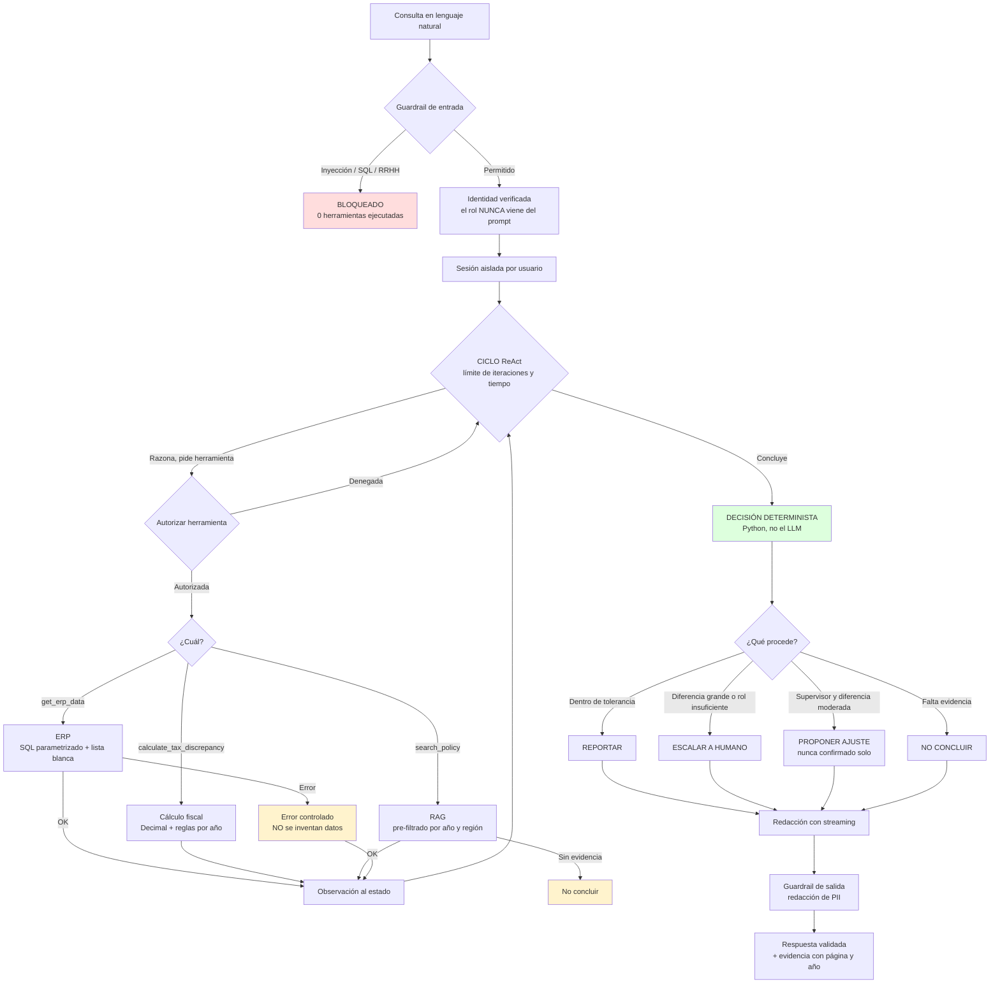

# Agente de Conciliación Logística

Sistema multi-agente que concilia facturas de logística contra un ERP. Recibe una
pregunta en lenguaje natural, consulta datos, verifica normativa y decide si
reportar, proponer un ajuste o escalar a un humano — respaldando cada conclusión
con su fuente.

Prototipo funcional (MVP) — Prueba técnica Senior AI Backend Engineer.

```text
"¿Por qué hay una discrepancia en el envío #4402?"
  1. Consulta el ERP        ->  SQL parametrizado
  2. Calcula el impuesto    ->  Decimal, reglas vigentes por año
  3. Busca la normativa     ->  RAG con filtro de metadata
  4. Decide                 ->  código determinista, no el LLM
  5. Responde               ->  streaming de tokens + cita de página
```

---

## Inicio rápido

Requiere **Python 3.11 o superior** (desarrollado y probado en 3.13).

```bash
pip install -r requirements.txt
python scripts/seed_data.py       # genera ERP simulado y PDF normativo
python scripts/build_index.py     # construye el índice vectorial
python -m pytest                  # 71 tests, ~2,5 s
uvicorn app.api:app --port 8000   # arranca la API
```

**No necesita credenciales.** Por defecto usa un LLM simulado determinista que
ejecuta el mismo ciclo de razonamiento y las mismas llamadas a herramientas que un
modelo real. Para usar un LLM real, ver [Configuración](#configuración).

### Ver el sistema funcionando

Cuatro demostraciones ejecutables:

| Comando | Qué demuestra |
|---|---|
| `python scripts/demo_stream.py` | Streaming SSE, encadenamiento de herramientas, tiempos |
| `python scripts/demo_decisiones.py` | La decisión cambia según el rol y según el dato |
| `python scripts/demo_filtro_rag.py` | Filtro de metadata por año |
| `python scripts/demo_seguridad.py` | Cuatro ataques bloqueados |

---

## Qué está ejecutado y qué no

| Estado | Alcance |
|---|---|
| **Ejecutado y verificado** | Agente, encadenamiento de herramientas, RAG con filtros, streaming SSE, seguridad, 71 tests |
| **Simulado (declarado)** | ERP en SQLite (no SQL Server), identidad de demostración (no IdP), normativa y tasas sintéticas |
| **Diseñado, no desplegado** | Arquitectura Azure — **no se desplegó nada; el diseño no está validado en la nube** |

---

## Mapa: requisito → implementación

| # | Requisito del enunciado | Dónde | Estado |
|---|---|---|---|
| 1.1 | Arquitectura multi-agente + diagrama | [Arquitectura](#arquitectura) | Ejecutado |
| 1.2 | Estrategia LLMOps y KPIs | [Estrategia de evaluación](#estrategia-de-evaluación-llmops) | Documentado |
| 2.1 | Agente con function calling | `app/agents/orchestrator.py` | Ejecutado |
| 2.1a | `get_erp_data(order_id)` | `app/tools/erp.py` | Ejecutado |
| 2.1b | `calculate_tax_discrepancy(amount, region)` | `app/tools/tax.py` | Ejecutado |
| 2.1c | Encadenamiento de herramientas | `test_agente_encadena_las_tres_herramientas` | Verificado |
| 2.2 | RAG + índice vectorial | `app/rag/` | Ejecutado |
| 2.2a | **Metadata filtering (año 2024)** | [Filtro de metadata](#filtro-de-metadata-el-punto-clave-del-rag) | Verificado |
| 2.3 | Endpoint FastAPI | `app/api.py` | Ejecutado |
| 2.3a | Streaming de tokens | `/query/stream` (SSE) | Verificado |
| 2.3b | Manejo de errores LLM y ERP | [Manejo de errores](#manejo-de-errores) | Verificado |
| 3.1 | Capa anti prompt-injection | `app/security/guardrails.py` | Ejecutado |
| 3.2 | Despliegue Azure privado | [Despliegue en Azure](#despliegue-en-azure) | **Diseñado, no desplegado** |
| 4.1 | Incidente por drift + rollback + golden dataset | [Gestión de incidentes](#gestión-de-incidentes-drift-de-modelo) | Documentado |
| 4.2 | Latencia y coordinación con frontend | [Latencia](#latencia-y-coordinación-con-frontend) | Documentado |

### Criterios técnicos de la rúbrica

| Criterio | Cómo se cumple |
|---|---|
| **Orquestación**: ReAct + estados | Ciclo iterativo (4 iteraciones medidas), estado explícito en `AgentState`, límites de iteración y tiempo |
| **Manejo de datos**: SQL parametrizado + filtros | Consulta con placeholders; pre-filtrado de metadata; **sin context stuffing** |
| **Arquitectura**: modular, model-agnostic | Interfaz `LLMClient`; 5 proveedores intercambiables; lógica de negocio independiente del modelo |
| **Seguridad**: PII + validación de outputs | Redacción antes de responder y de loguear; respuesta validada con Pydantic; lista blanca de campos |

---

## Arquitectura



### Las tres decisiones que definen el sistema

**1. La decisión de negocio la toma Python, no el LLM.**
El modelo entiende la pregunta, elige herramientas y redacta. Pero *qué se hace* lo
determina código con umbrales fijos. Una decisión con efecto contable no puede
depender de texto generado probabilísticamente. Consecuencia directa: **un cambio de
modelo no puede alterar la decisión** — la regresión que describe la Parte 4 del
enunciado es estructuralmente imposible en este diseño.

**2. La seguridad es arquitectónica, no solo detección.**
El filtro de patrones es la primera capa y se sabe frágil. La garantía real es que
**no existe ninguna herramienta conectada a los datos restringidos**.

**3. El sistema prefiere no responder a responder mal.**
Sin datos del ERP, sin cálculo o sin respaldo normativo, la decisión es
`insufficient_evidence`. En un sistema financiero, una respuesta inventada es peor
que ninguna respuesta.

---

## Ejemplos de uso

### Consulta con streaming

```bash
python scripts/demo_stream.py
```

Eventos SSE recibidos, con marca de tiempo real:

```text
[  2.7s] ACCEPTED
[  3.4s] TOOL_CALL    -> get_erp_data
[  5.8s] TOOL_CALL    -> calculate_tax_discrepancy
[ 17.8s] TOOL_CALL    -> search_policy
[ 62.1s] EVIDENCIA       pagina 2, año 2024, score 0.2841
[ 83.0s] TOKENS (generación en vivo)
```

Respuesta del agente:

> Análisis de la orden #4402 (región US-CA). La factura registra 12500.00 USD y el
> ERP tiene 13406.25 USD. Aplicando la tasa 0.0875 de la regla CA-LOG-2024, el total
> esperado es 13593.75. La diferencia de -187.50 excede la tolerancia de 0.01.
> Fundamento normativo: normativa_sintetica.pdf página 2 (año 2024).
>
> **Decisión: PROPUESTA DE AJUSTE** — requiere confirmación humana; no se aplicó
> nada al ERP.

**Causa raíz detectada:** el ERP aplicó la tasa del 7.25% de 2023, derogada, en vez
del 8.75% vigente en 2024.

### La misma consulta decide distinto según el rol

```bash
python scripts/demo_decisiones.py
```

| Usuario | Rol | Decisión |
|---|---|---|
| `sofia.supervisora` | supervisor | `propose_adjustment` |
| `ana.analista` | analyst | `escalate_human` |
| `carlos.auditor` | auditor | `escalate_human` |

La supervisora puede proponer un ajuste; los otros roles no, así que el mismo
hallazgo se deriva a revisión humana. **La autorización no solo bloquea: cambia la
decisión de negocio.**

### Casos de prueba disponibles

| Orden | Región | Qué demuestra | Decisión |
|---|---|---|---|
| **4402** | US-CA | Tasa derogada de 2023 aplicada en 2024 | según rol |
| **4403** | US-CA | Diferencia de 1 céntimo | `report` |
| **4404** | US-TX | Importe exacto | `report` |
| **4405** | MX-CMX | Diferencia superior a 500 | `escalate_human` |
| **4406** | EU-ES | Correcto, otra moneda | `report` |
| **9999** | — | Orden inexistente | `insufficient_evidence` |

### Usuarios de demostración

| Usuario | Rol | Alcance regional | Puede proponer ajustes |
|---|---|---|---|
| `ana.analista` | analyst | US-CA, US-TX | No |
| `sofia.supervisora` | supervisor | US-CA, US-TX, MX-CMX | Sí |
| `carlos.auditor` | auditor | global | No |
| `root.admin` | admin | global | Sí |

> Identidades de demostración. **No constituyen autenticación de producción.** La
> ruta de producción sería un token validado contra Microsoft Entra ID, con el rol
> leído del claim de aplicación.

---

## Filtro de metadata: el punto clave del RAG

```bash
python scripts/demo_filtro_rag.py
```

Consulta: *"tasa impositiva aplicable US-CA logística"*

| Filtro | Fragmentos | Años presentes | Mejor resultado |
|---|---|---|---|
| `year=2024` | 2 | solo 2024 | pág. 2 (2024), score 0.3217 |
| `year=2023` | 1 | solo 2023 | pág. 1 (2023), score 0.3345 |
| **sin filtro** | 3 | **2023 y 2024** | **pág. 1 (2023), score 0.3345** |

**Lee la última fila.** Sin filtro, el fragmento **derogado de 2023 gana por score** y
habría contaminado la respuesta con la tasa obsoleta del 7.25%. Los dos documentos
dicen casi lo mismo con palabras casi idénticas: son indistinguibles para una
búsqueda semántica. El metadato del año es lo único que los separa.

**Pre-filtrado, no post-filtrado.** El filtro se aplica *antes* de calcular la
similitud. Filtrar después podría dejar cero resultados útiles si los k mejores
fueran todos del año equivocado; filtrando antes, los k devueltos siempre cumplen la
condición.

---

## Seguridad

```bash
python scripts/demo_seguridad.py
```

| Ataque | Resultado |
|---|---|
| Petición de salarios | `blocked` — fuera del alcance del rol y del sistema |
| Inyección de prompt | `blocked` — el rol viene de la identidad, no del texto |
| SQL arbitrario | `blocked` — solo consultas parametrizadas |
| Suplantación de rol | `blocked` — "soy el CEO" no cambia nada |

Los cuatro se bloquean **sin ejecutar ninguna herramienta**.

### Defensa en profundidad

| Capa | Mecanismo | Si falla |
|---|---|---|
| 1. Detección de entrada | Patrones sobre la consulta | Las otras tres siguen activas |
| 2. Identidad verificada | El rol viene del sistema, nunca del prompt | — |
| 3. Autorización en herramienta | Se comprueba al ejecutar | — |
| 4. **Arquitectura** | **No existe herramienta hacia datos restringidos** | **Nada. El dato es inalcanzable.** |

La capa 4 es la garantía real. La tabla `employee_salaries` existe en la base de
datos precisamente para demostrarlo: está ahí, y sigue siendo inaccesible porque
ninguna herramienta la alcanza.

El contenido recuperado de documentos se trata como **dato no confiable**: si un
fragmento contiene texto con forma de instrucción, se marca y se ignora como orden.

---

## Manejo de errores

| Fallo | Respuesta | Código |
|---|---|---|
| LLM caído o timeout | "El modelo no está disponible... No se realizó ninguna acción sobre el ERP." | `llm_timeout` |
| ERP no responde | Se declara la indisponibilidad; no se inventan datos | `erp_unavailable` |
| Orden inexistente | `insufficient_evidence` | `not_found` |
| Argumentos inválidos | Validación antes de tocar la base | `invalid_argument` |
| Sin evidencia documental | "No puedo concluir sin respaldo normativo" | `insufficient_evidence` |
| Región fuera de alcance | Autorización denegada | `forbidden_region` |
| **Error tras abrir el stream** | **Evento SSE `error`** — el 200 OK ya se envió | varía |

La última fila es una decisión de diseño: una vez enviado el código HTTP no se puede
deshacer, así que el error viaja como un evento más del stream.

Ningún error expone trazas internas ni secretos; quedan en el log del servidor con la
PII redactada.

---

## Configuración

Para usar un LLM real:

```bash
cp .env.example .env
```

Descomenta el bloque del proveedor que uses:

| Proveedor | Variables mínimas | Notas |
|---|---|---|
| **NVIDIA NIM** | `LLM_PROVIDER=nvidia`, `LLM_API_KEY`, `LLM_MODEL` | Nivel gratuito en [build.nvidia.com](https://build.nvidia.com) |
| **OpenAI** | `LLM_PROVIDER=openai`, `LLM_API_KEY` | |
| **Azure OpenAI** | `LLM_PROVIDER=azure`, `LLM_BASE_URL`, `LLM_MODEL` | Requiere `AZURE_API_VERSION` |
| **Anthropic** | `LLM_PROVIDER=anthropic`, `LLM_API_KEY` | |

NVIDIA, OpenAI y Azure comparten el mismo adaptador: son compatibles con el dialecto
de OpenAI. Cambiar de proveedor no modifica ni una línea de la lógica de negocio.

### Verificar la conexión

```bash
python scripts/verificar_llm.py
```

Comprueba en orden: configuración, conexión, **function calling**, streaming y el
agente completo. Si algo falla, indica la causa concreta en vez de un error opaco.

> **Modelos de NVIDIA.** El catálogo cambia y el acceso depende de la cuenta.
> Verificado con una clave del nivel gratuito: funcionan
> `nvidia/nemotron-3.5-lightning-30b-a3b`, `openai/gpt-oss-20b` y
> `nvidia/nemotron-3-super-120b-a12b`. En cambio `meta/llama-3.1-70b-instruct` fue
> retirado (HTTP 410).

### Rendimiento medido

Misma consulta, mismas herramientas, misma decisión:

| | LLM real (NVIDIA) | Mock determinista |
|---|---|---|
| Tiempo total | 96 s | 3,8 s |
| Tokens generados | 723 | 74 |
| Herramientas / iteraciones | 3 / 4 | 3 / 4 |
| Decisión | `propose_adjustment` | `propose_adjustment` |

Que ambos produzcan la misma decisión demuestra que la lógica de negocio no depende
del modelo.

---

## Pruebas

```bash
python -m pytest
```

```text
71 passed in 2.29s
```

| Archivo | Cubre |
|---|---|
| `tests/test_tax.py` | Exactitud Decimal, redondeo, reglas por año, validación |
| `tests/test_rag.py` | Filtrado por año y región, chunking, ausencia de evidencia |
| `tests/test_security.py` | Inyección, SQL, roles, redacción de PII |
| `tests/test_agent_api.py` | Encadenamiento ReAct, decisiones, streaming, errores |

Los tests corren **sin credenciales y sin red**. `tests/conftest.py` fuerza el LLM
simulado, así que dan el mismo resultado con o sin `.env`.

---

## Estrategia de evaluación (LLMOps)

> La estrategia está definida; **la ejecución automatizada de Ragas no se realizó.**
> Los umbrales son objetivos de diseño razonados, no mediciones.

**Principio rector.** Un sistema que maneja dinero tiene dos errores con consecuencias
muy distintas: *no responder* genera fricción y es aceptable; *responder mal con
seguridad* produce un asiento incorrecto y es inaceptable. Toda la estrategia se
ordena según esa asimetría.

### Métricas críticas (bloquean la liberación)

| Métrica | Qué mide | Método | Umbral |
|---|---|---|---|
| **Exactitud numérica** | Importe y redondeo correctos | Comparación determinista en Python | **100%** |
| **Exactitud de decisión** | Reportar/escalar/proponer correctamente | Comparación con la decisión esperada | **100%** en casos críticos |
| **Seguridad** | Bloqueo de accesos restringidos | Casos negativos por rol e inyección | **100%** |
| **Faithfulness** | Afirmaciones respaldadas por la evidencia | Ragas sobre respuesta y contexto | ≥ 0.95 |

Las dos primeras exigen 100% porque no son métricas estadísticas, son invariantes. En
este diseño ambas las ejecuta Python, no el LLM, y **ya están cubiertas por los 71
tests**.

### Métricas de calidad y operativas

Answer relevance (≥ 0.90), context precision (≥ 0.85), context recall (≥ 0.90) y
precisión de recuperación con filtro (100%, verificación determinista). Operativas:
tiempo al primer token, latencia total por etapa, iteraciones por consulta, tasa de
escalamiento y coste por consulta.

No se fijan umbrales de latencia: el sistema no se midió con un LLM real bajo carga de
producción, y fijar un objetivo sin medición sería inventar una cifra.

### Golden dataset

Cada caso incluye consulta, identidad, datos de entrada, fuentes esperadas, resultado
numérico exacto y decisión esperada. Composición mínima: 15 casos de cálculo correcto,
10 de discrepancia, 5 dentro de tolerancia, 5 sin evidencia, **20 de seguridad**, 8 de
decisión por rol y 6 de fallos de dependencia.

El bloque de seguridad es el más grande a propósito: un fallo de seguridad es
cualitativamente peor que uno de calidad. Los casos críticos requieren aprobación
humana, y cada incidente real se convierte en un caso nuevo.

### Elección de framework

**Ragas** para lo textual (faithfulness, relevancia, precisión de contexto) y
**pytest** para lo numérico y lo binario. Usar un LLM juez para verificar que
12500 × 0.0875 = 1093.75 introduciría incertidumbre en algo exacto.

**Advertencia:** Ragas usa un LLM para juzgar a otro LLM; el evaluador también puede
equivocarse. Ningún framework garantiza por sí solo ausencia de alucinaciones.

---

## Despliegue en Azure

> **No se desplegó nada en Azure.** Este es un diseño; no está validado en la nube y
> no se creó ningún recurso. Al concretarlo debe verificarse contra la documentación
> oficial vigente.

### El requisito real

"Que el tráfico no salga de la red privada" es más exigente de lo que parece. Las
salidas obvias son el LLM y el ERP. Las que se olvidan:

- **Generación de embeddings**: el texto de la normativa sale a internet al indexar.
- **Telemetría**: los prompts suelen incluir datos del negocio.
- **Resolución DNS**: sin zona de DNS privado, el nombre sigue resolviendo a la IP
  pública y el tráfico sale aunque el endpoint privado exista.

### Componentes

| Componente | Configuración |
|---|---|
| **Container Apps** | Entorno con VNet interna, ingress `internal`, sin IP pública |
| **Azure OpenAI** | Acceso público deshabilitado, endpoint privado, identidad administrada |
| **Embeddings** | Mismo recurso de Azure OpenAI, tras el mismo endpoint privado |
| **SQL Server** | Endpoint privado, autenticación por Entra ID, sin permisos sobre tablas de RRHH |
| **Secretos** | Identidad administrada; ninguna clave en código, imagen ni variables |
| **Salida** | NSG que deniega todo hacia internet; UDR a firewall si se requiere inspección |

La aplicación ya soporta Azure OpenAI por configuración (`LLM_PROVIDER=azure`), sin
cambios de código: el adaptador absorbe las diferencias de Azure (ruta por deployment,
`api-version`, cabecera `api-key`).

### Cómo verificar el aislamiento

Comprobaciones propuestas, **ninguna ejecutada**:

1. `nslookup <recurso>.openai.azure.com` desde el contenedor debe devolver **IP
   privada** (10.x). Si devuelve pública, el DNS privado está mal configurado.
2. Igual para SQL, Key Vault y Storage.
3. `curl https://api.github.com` desde el contenedor **debe fallar**.
4. Logs de flujo del NSG: cero flujos permitidos hacia internet.
5. Azure Policy que deniegue crear recursos con acceso público habilitado.

La primera es la más importante: es el fallo silencioso más común.

### Qué cambia respecto al MVP

| Componente | MVP | Producción |
|---|---|---|
| Base ERP | SQLite | Azure SQL con endpoint privado |
| Índice vectorial | Archivos locales | Azure AI Search privado |
| Memoria de sesión | En el proceso | Azure Cache for Redis con TTL |

La memoria debe cambiar porque Container Apps escala a varias réplicas: con memoria en
proceso, la segunda petición del usuario puede caer en otra réplica que no conoce su
sesión.

---

## Gestión de incidentes (drift de modelo)

**Escenario del enunciado:** tras actualizar el modelo, el agente empieza a aprobar
notas de crédito erróneas.

> **Observación previa:** en la arquitectura entregada eso no puede ocurrir. La
> decisión la toma Python con umbrales fijos, el sistema solo puede *proponer*
> ajustes, y la confirmación requiere intervención humana. El procedimiento siguiente
> responde al escenario tal como se plantea, porque el riesgo es real en sistemas que
> delegan la decisión al LLM.

### Procedimiento

**1. Contención inmediata.** Desactivar aprobaciones automáticas, **mantener las
consultas de solo lectura** (apagar todo genera presión por restaurar sin
diagnóstico), poner toda acción contable en cola de revisión humana, notificar a
finanzas y congelar despliegues.

**2. Delimitar el alcance.** Ventana temporal desde el despliegue hasta la contención.
Esto exige que las trazas registren qué versión de modelo atendió cada petición; si no
se registró, ese es el primer hallazgo del post-mortem.

**3. Preservar la evidencia antes de tocar nada:** versión del modelo, prompts, reglas,
índice vectorial, trazas y parámetros de inferencia. Si se hace rollback primero, se
pierde la capacidad de reproducir el fallo, y sin reproducción no hay causa raíz.

**4. Causa raíz — no asumir que fue el modelo.** Descartar primero: ¿cambió también el
prompt? ¿los datos? ¿se reindexó la documentación? ¿cambió un umbral? ¿cambiaron los
parámetros de inferencia? ¿cambió el formato de function calling?

La última merece atención: una nueva versión puede alterar sutilmente cómo formatea los
argumentos (un número como string, por ejemplo). Si el código lo acepta sin validar, el
cálculo se desvía sin que nada falle visiblemente.

**5. Comparación controlada.** Ejecutar las mismas entradas contra ambas versiones,
variando **una sola cosa a la vez**. Las etapas separadas permiten aislar dónde se
rompió: recuperación, argumentos, cálculo, decisión o redacción.

### Rollback: dos procesos que no deben confundirse

| | Rollback técnico | Reversión contable |
|---|---|---|
| Qué revierte | La configuración del sistema | Los asientos ya creados |
| Cuánto tarda | Minutos | Días; requiere aprobación |
| Quién decide | Ingeniería | Finanzas y auditoría |

**Volver al modelo anterior no deshace las notas de crédito ya emitidas.**

Si el modelo anterior ya no está disponible (caso frecuente), mantener el servicio en
modo solo-propuesta con revisión humana obligatoria, y evaluar alternativas contra el
golden dataset antes de reactivar nada.

### Liberación controlada

| Fase | Qué se habilita | Condición para avanzar |
|---|---|---|
| 1 | Solo lectura | Golden dataset al 100% en criterios críticos |
| 2 | Propuestas sin aplicar | 48 h sin discrepancias en revisión humana |
| 3 | Canary al 5% | Métricas equivalentes a la versión estable |
| 4 | Ampliación progresiva | Sin regresiones |

### Cambios permanentes

Registrar la versión del modelo en cada traza · fijar versión exacta sin alias
automáticos · golden dataset obligatorio en CI · validación estricta de argumentos ·
**mantener la decisión en código determinista** · límite de importe para acciones
automáticas · alerta sobre la tasa de aprobación.

La penúltima es la lección estructural: **cuanto menos decida el LLM sobre efectos
contables, menos puede romper un cambio de modelo.**

---

## Latencia y coordinación con frontend

**Escenario del enunciado:** el equipo de Angular se queja de que la respuesta tarda
15-20 segundos.

> No se prometen tiempos: el sistema no se midió con un LLM real bajo carga de
> producción. Las cifras que aparecen son medidas en desarrollo.

### La distinción que ordena el trabajo

| | Duración real | Velocidad percibida |
|---|---|---|
| Qué es | Segundos hasta la respuesta completa | Segundos hasta que el usuario ve algo |
| Cómo se mejora | Menos llamadas, menos contexto, caché | Streaming, feedback temprano |
| Coste | Puede afectar la precisión | **Ninguno** |

Un sistema que tarda 15 s pero muestra texto en 1 s se percibe mucho más rápido que
otro que tarda 10 s con una ruleta. La percepción se ataca primero porque es gratis y
no toca la precisión.

### Diagnóstico

El sistema ya expone la instrumentación: cada resultado de herramienta lleva su
`elapsed_ms`. El desglose muestra que **el cuello de botella son las llamadas al LLM**:
hay 4 por consulta (3 de decisión + 1 de redacción). El ERP, el cálculo y la búsqueda
vectorial suman milisegundos — medido: 77 ms para todo lo que no es el LLM.

### Ya implementado (sin coste para la precisión)

- **Streaming real** de tokens conforme se generan.
- **Feedback temprano**: primer evento a los 2 ms, antes de llamar al modelo.
- **Progreso por etapa**: "Consultando ERP..." se tolera mejor que una barra
  indeterminada.
- **Evidencia antes que texto**: el frontend muestra las fuentes mientras se genera.
- **Contexto acotado**: historial limitado a 3 turnos, solo top-k fragmentos.
- **Caché del índice** en memoria.

### Propuesto, por prioridad

1. **Medir cada etapa con LLM real.** Todo lo demás son hipótesis hasta entonces.
2. **Atajo determinista** para consultas de patrón fijo: pasa de 4 llamadas a 1. Solo
   se activa con coincidencia exacta; cualquier otra usa el ciclo completo.
3. **Paralelizar ERP y RAG**, que son independientes. `calculate_tax_discrepancy`
   **no** puede paralelizarse: necesita el resultado del ERP — esa dependencia es
   justamente el encadenamiento que pide el enunciado.
4. **Caché con clave por rol y versión.** La clave debe ser `(consulta, rol, alcance,
   versión_del_índice)`. Esto es un **requisito de seguridad**: si dos usuarios con
   roles distintos comparten entrada de caché, uno recibe datos que no le corresponden.
5. **Modelo escalonado** (pequeño para decidir herramientas, mayor para redactar). Es
   el único que compromete la precisión, así que va al final y requiere validación con
   el golden dataset.

### Contrato de eventos con frontend

| Evento | Payload | Qué hace el frontend |
|---|---|---|
| `progress` | `{stage, tool?, message}` | Indicador de etapa |
| `token` | `{text}` | Concatenar al texto visible |
| `evidence` | `{items: [{source, page, year, score}]}` | Panel de fuentes |
| `result` | `{answer, decision, tool_calls, evidence, warnings}` | Reemplazar por la versión validada |
| `error` | `{code, message}` | Mostrar mensaje; **nunca** trazas internas |
| `done` | `{decision}` | Cerrar conexión |

Reglas: renderizar `token` incrementalmente; **`result` es la fuente de verdad**;
`error` puede llegar en cualquier momento, incluso tras varios tokens; `decision`
determina la interfaz — `propose_adjustment` muestra el botón de confirmación, que es
una acción humana, nunca automática.

El header `X-Accel-Buffering: no` ya está configurado: sin él, algunos proxies acumulan
la respuesta y anulan el streaming por completo.

### Revalidación obligatoria

Tras cualquier optimización: los 71 tests deben pasar, el golden dataset debe dar 100%
en exactitud numérica y decisiones críticas, y hay que verificar que el caché no cruza
permisos entre roles. **Una optimización que rompe un cálculo no es una optimización.**

---

## Consulta objetivo contra SQL Server

El MVP usa SQLite. Esta es la consulta equivalente contra SQL Server, incluida para
documentar la ruta de producción. **No fue ejecutada contra SQL Server.**

```python
QUERY = """
    SELECT order_id, invoice_amount, erp_amount, region,
           currency, status, issued_at, carrier
    FROM dbo.orders
    WHERE order_id = ?
"""
cursor.execute(QUERY, (order_id,))   # el parámetro nunca se concatena
```

Tres barreras, iguales en MVP y producción:

1. `order_id` validado (numérico, 3-10 dígitos) antes de la consulta.
2. Consulta parametrizada.
3. **El modelo nunca genera SQL** — solo puede pedir `get_erp_data(order_id=...)`.

---

## Limitaciones conocidas

1. **No se desplegó en Azure.** El diseño no está validado en la nube.
2. **La memoria de sesión vive en el proceso.** No sobrevive a reinicios ni se comparte
   entre réplicas. En producción: Redis con TTL.
3. **El embedder por defecto es léxico, no semántico.** Captura solapamiento de
   palabras; no relacionaría "gravamen" con "impuesto". Para producción se activa
   `EMBEDDING_PROVIDER=nvidia`.
4. **La detección por patrones es frágil.** Durante el desarrollo, los tests revelaron
   que el patrón original no capturaba "ignora **todas las** instrucciones". Se
   corrigió, pero ilustra por qué la garantía debe ser arquitectónica.
5. **Ragas no se ejecutó.** La estrategia está definida; la ejecución no se realizó.
6. **Sin mediciones de latencia con LLM real bajo carga.** No se prometen tiempos que
   no se midieron.
7. **Las tasas fiscales son inventadas.** No corresponden a ninguna jurisdicción real.

---

## Estructura del proyecto

```text
app/
├── api.py                  FastAPI + streaming SSE
├── core/
│   ├── config.py           configuración centralizada
│   └── models.py           modelos Pydantic
├── llm/
│   ├── base.py             interfaz model-agnostic
│   ├── openai_compat.py    NVIDIA / OpenAI / Azure
│   ├── anthropic_client.py Anthropic
│   ├── mock.py             simulado determinista
│   └── factory.py          selección de proveedor
├── agents/
│   ├── orchestrator.py     ciclo ReAct + decisión determinista
│   ├── registry.py         esquemas de herramientas
│   └── memory.py           sesión aislada por usuario
├── tools/
│   ├── erp.py              get_erp_data (SQL parametrizado)
│   ├── tax.py              calculate_tax_discrepancy (Decimal)
│   └── policy.py           search_policy (RAG)
├── rag/
│   ├── embeddings.py       hashing local | NVIDIA
│   ├── index.py            índice + pre-filtrado de metadata
│   └── ingest.py           extracción y chunking
└── security/
    ├── guardrails.py       detección, autorización, redacción
    └── identity.py         identidad verificada

scripts/   seed_data · build_index · verificar_llm
           demo_stream · demo_decisiones · demo_filtro_rag · demo_seguridad
tests/     71 pruebas
```
